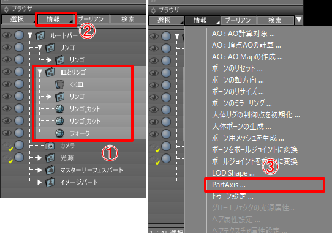
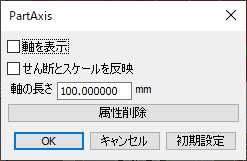
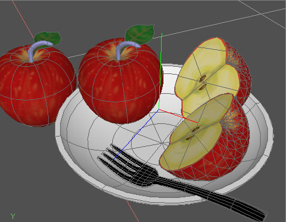
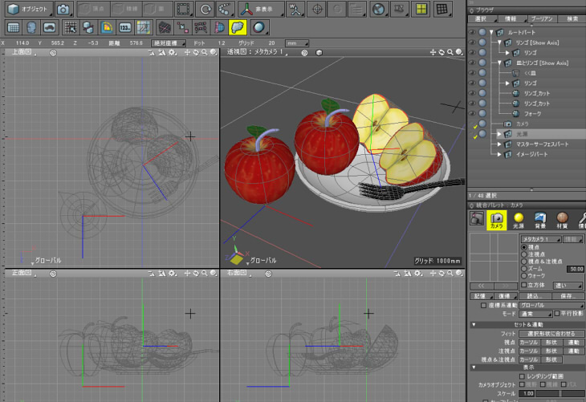

# PartAxis for Shade3D

Shade3Dでパートの変換行列を視覚化するプラグインです。    

## 動作環境
* Windows 7/8/10以降のOS
* macOS 10.11以降のOS
* Shade3D ver.15以降で、Standard/Professional版（Basic版では動作しません）

## 機能

* 形状に対して図形ウィンドウでワイヤーフレームで座標軸を表示
* パートに座標軸を表示することにより、図形ウィンドウからパートを選択できるようになります。

## 使い方

### プラグインダウンロード
以下から最新版をダウンロードしてください。  
https://github.com/ft-lab/Shade3D_PartAxis/releases  

### プラグインを配置し、Shade3Dを起動
Winの場合は、ビルドされた PartAxis64.dll をShade3Dのpluginsディレクトリに格納してShade3Dを起動。  
Macの場合は、ビルドされた PartAxis64.shdpluginをShade3Dのpluginsディレクトリに格納してShade3Dを起動。   
ブラウザの「情報」をクリックして表示されるコンテキストメニューで「PartAxis」が表示されるのを確認します。   


### 使い方

パートをブラウザで選択し、「情報」をクリックしてコンテキストメニューを表示します。    
コンテキストメニューで「PartAxis」を選択します。    
     
「PartAxis」ダイアログボックスで「軸を表示」チェックボックスをOnにしてOKボタンを押します。    
      
これで、選択されたパートの中心に座標軸が表示されます。    
      
なお、図形ウィンドウ表示が「ワイヤーフレーム」や「テクスチャ+ワイヤーフレーム」など、ワイヤーフレーム表示の場合に座標軸が表示されます。    

個々の形状に対してこの割り当てを行うことで、シーン上の複数のパートに対して座標軸を表示できます。    
  

なお、この図形ウィンドウ上で座標軸をクリックすることで、パートを選択することができます。     
座標軸はパートでなくても指定できます。    

## PartAxisダイアログボックスの指定
      

「軸を表示」チェックボックスをOnにすると、そのパートに対して座標軸を表示します。    
ブラウザ上で、これがOn時は[Show Axis]のラベルが表示されます。     
Off時は[Hide Axis]のラベルが表示されます。    
「せん断とスケールを反映」チェックボックスをOnにすると、パートの変換行列の「せん断」と「スケール」の影響が表示される座標軸に反映されます。    
「軸の長さ」は表示する座標軸の長さ（単位 mm）です。    
「属性削除」ボタンを押すと、PartAxisの属性が削除されます。    

この属性は、ブラウザで複数パートを選択してまとめて変更できます。    


## ビルド方法 (開発向け)

Windows環境では「Visual Studio 2017」(無償のCommunity版でビルドできます)、  
Mac環境では「Xcode 10.1」でビルドしました。  

### Shade3D Plugin SDKをダウンロード

https://shade3d.jp/community/sdn/sdk.html より、  
Shade 3D ver.15.1 Plugin SDKをダウンロードします。  
もしくは、GitHub上の  
https://github.com/shadedev/pluginsdk  
をダウンロードします。 

### プロジェクトの配置

SDKの「plugin_projects」ディレクトリに   
GitHubでダウンロードしたファイルの「projects」ディレクトリ内の「PartAxis」を複製します。   
以下のようなディレクトリ構成にします。   
```
  [plugin_projects]  
    [PartAxis]  
      [mac]  
      [source]  
      [win_vs2017]  
```

Win環境の場合は「plugin_projects/PartAxis/win_vs2017/Template.sln」を  
Visual Studio 2017で開いてビルドします。   
Mac環境の場合は「plugin_projects/PartAxis/mac/plugins/Template.xcodeproj」をXcodeで開いてビルドします。  

## ライセンス  

This software is released under the MIT License, see [LICENSE.txt](./LICENSE).  

## 更新履歴

[2020/02/14]  ver.1.0.0.0  
* 初回バージョン
